# MentalBloom


[](LICENSE)


Mental health struggles are often invisible until they become overwhelming. MentalBloom is an AI-powered mobile wellness companion that helps users recognize emotional patterns early — through mood tracking, reflective journaling, and guided mindfulness.

Built with Flutter and Firebase, it integrates OpenRouter to orchestrate multiple LLMs with automatic fallback logic when rate limits are hit. The AI layer uses a custom system prompt tuned for mental health safety, including emotion reflection rules and a crisis protocol.

This project was built to explore the real challenges of integrating LLMs into a mobile app — model fallback, real-time data sync, and responsible AI design in a sensitive context.

---

## ▶️ Demo

[](https://www.youtube.com/watch?v=Aog5Clst8ng)

---

## 🛠 Tech Stack

### **Core Technologies**
* **Flutter**: Cross-platform mobile framework used for building a high-performance, responsive UI.
* **Dart**: Type-safe, expressive language used for the entire application logic.

### **AI Implementation**
* **LLM Orchestration**: Integrated **OpenRouter API** to dynamically access a variety of state-of-the-art models including `GPT-4o mini`, `Claude 3.5 Haiku`, `Gemini 1.5 Flash`, and `Llama 3.3`.
* **Prompt Engineering**: Developed custom system prompts to ensure the AI maintains an empathetic, supportive, and safe therapeutic tone appropriate for mental health contexts.
* **Model Tiering**: Implemented logic to utilize different model groups based on performance and latency requirements.
* **Fallback Logic**: Built a robust heuristic-based fallback system that provides curated quotes and support when API limits are reached.

### **Backend & Infrastructure**
* **Firebase**: Utilized **Firebase Auth** for secure user sessions and **Cloud Firestore** for real-time, scalable data persistence.
* **State Management**: Implemented **Provider** (ChangeNotifier) for reactive UI updates and clean separation of concerns.
* **Data Visualization**: Integrated `fl_chart` for rendering emotional distributions and historical data.


---

## ✨ Features


### Core Wellness Features
- 🌬️ **Breathing Exercises** - Guided breathing sessions with customizable durations
- 📝 **Journaling** - Rich text editor for daily reflections and mood entries
- 🎯 **Mood Tracking** - Log and visualize emotional patterns over time
- 🌸 **Gratitude Jar** - leverages LLMs to provide personalized, mood-based motivational quotes.
- 📊 **Analytics & History** - Advanced data visualization using `fl_chart` to track emotional trends over time.


### 🤖 AI-Powered Features
- **Intelligent Chatbot** - Get personalized support and wellness recommendations powered by OpenRouter's AI models
- **Personalized quotes** - Receive AI-generated motivational quotes based on emotional history


### Authentication & Security
- 🔐 Secure user authentication via Firebase
- 🔒 Secure data storage via Google Cloud Firestore (journals, mood entries, user profiles)

---

## 🏗️ Architecture Diagram

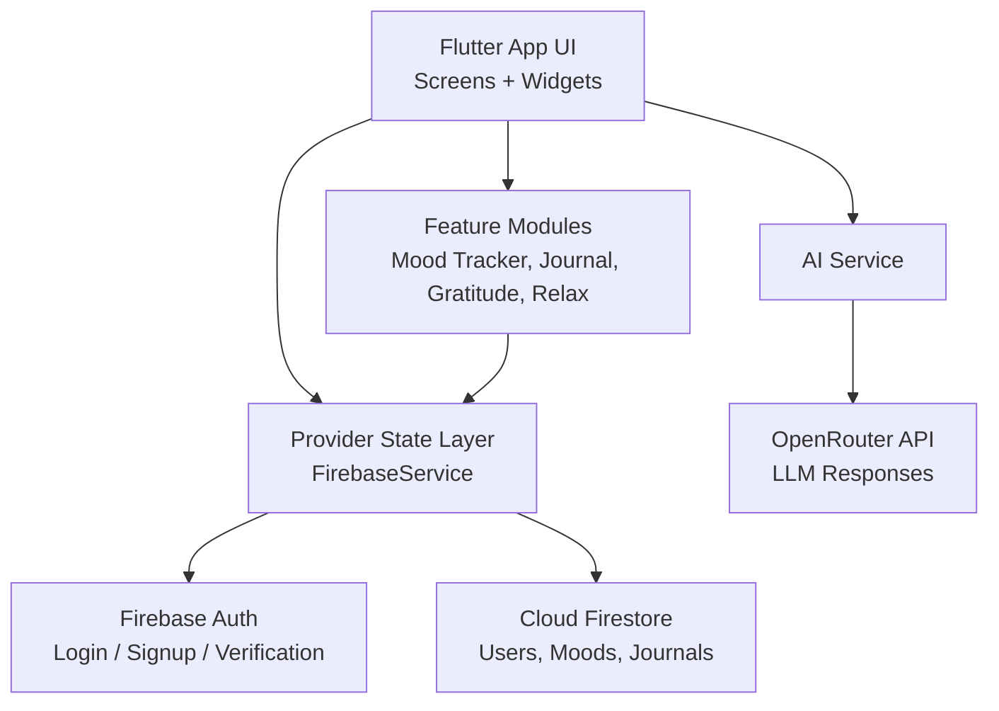

---

## 📸 Screenshots

### Authentication
<p align="center">
   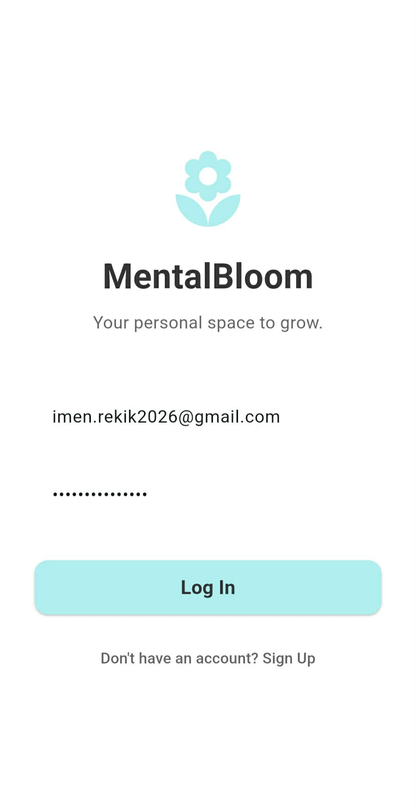
   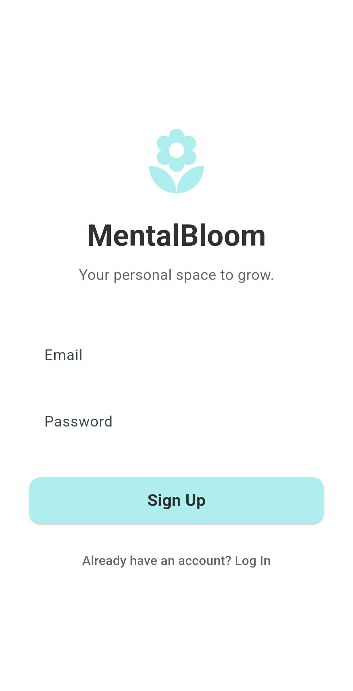
   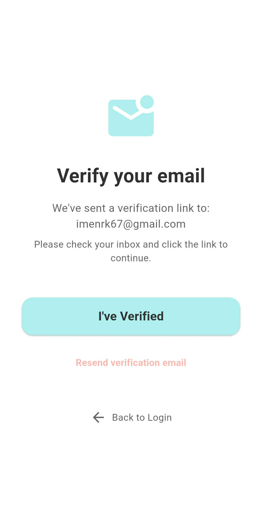
</p>
<p align="center">
   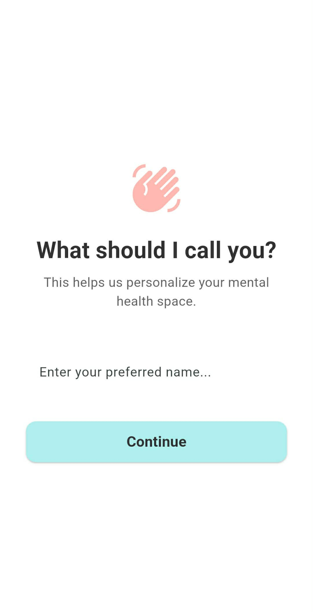
</p>

### Dashboard & Mood Tracking
<p align="center">
   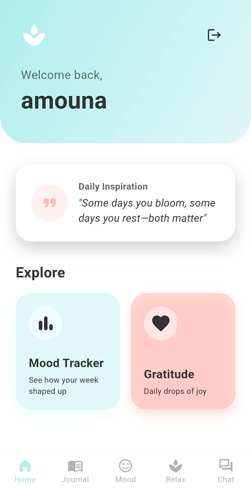
   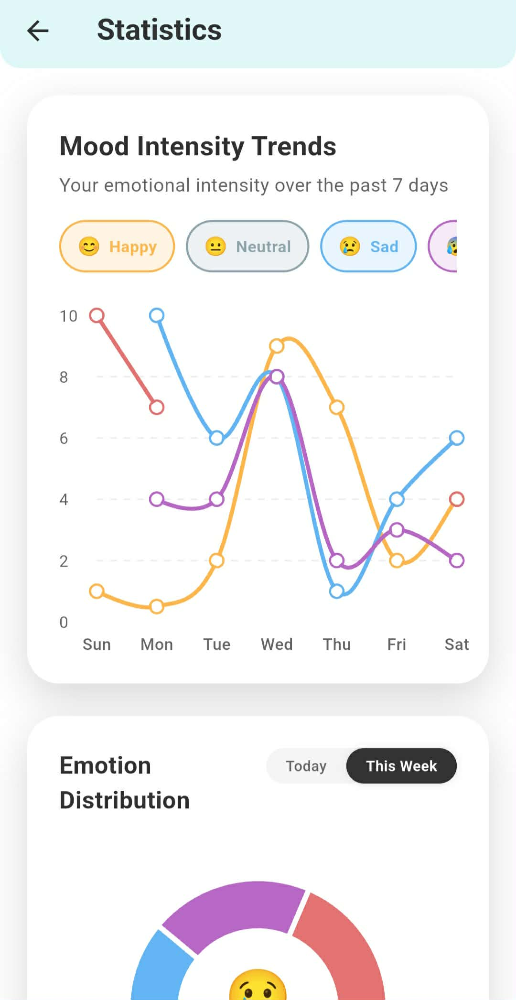
   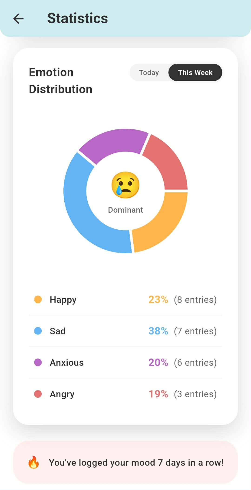
</p>
<p align="center">
   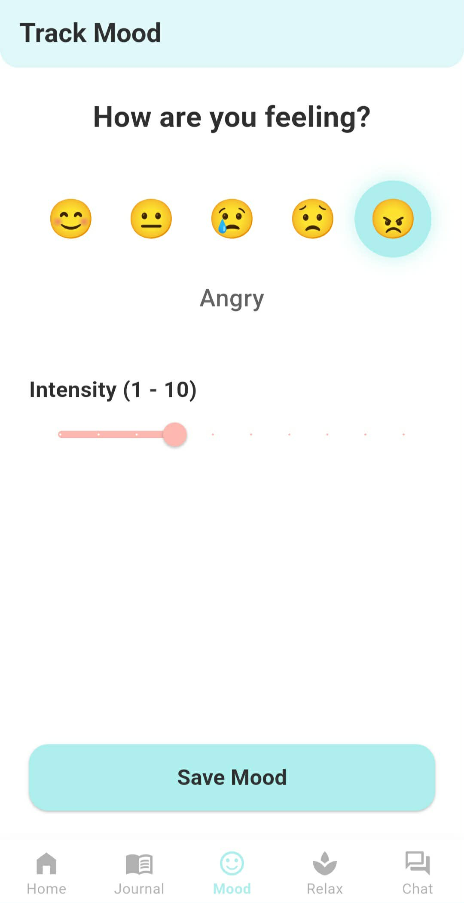
   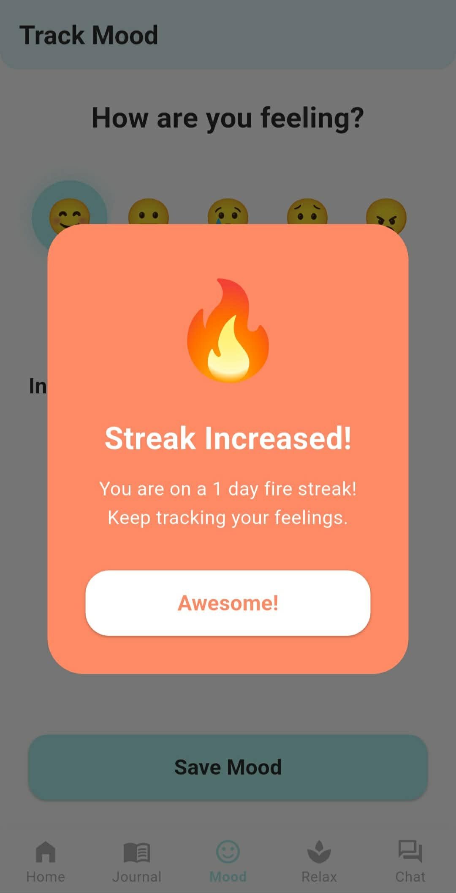
</p>

### Gratitude & Quotes
<p align="center">
   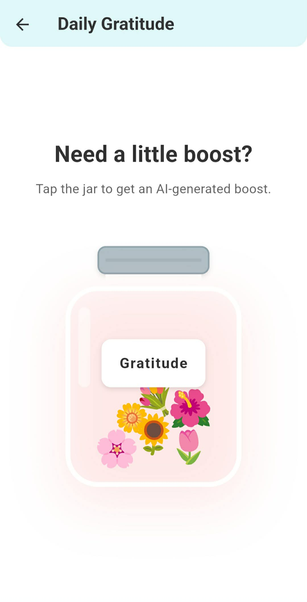
   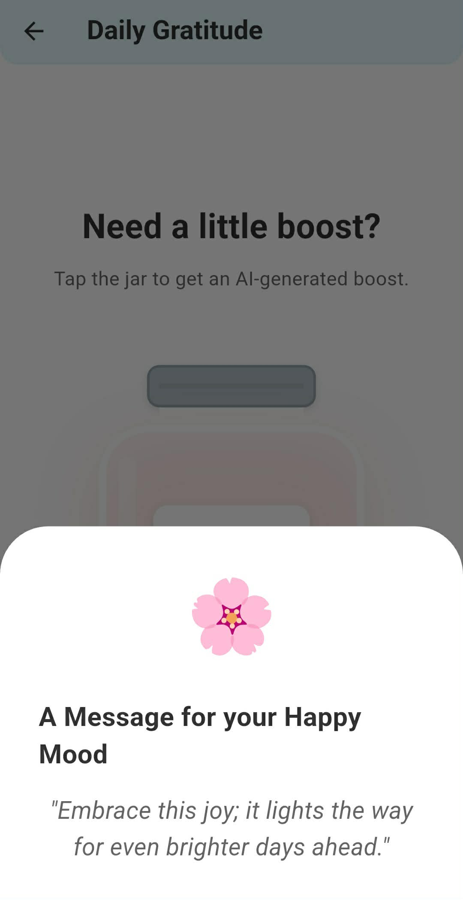
</p>

### Journaling
<p align="center">
   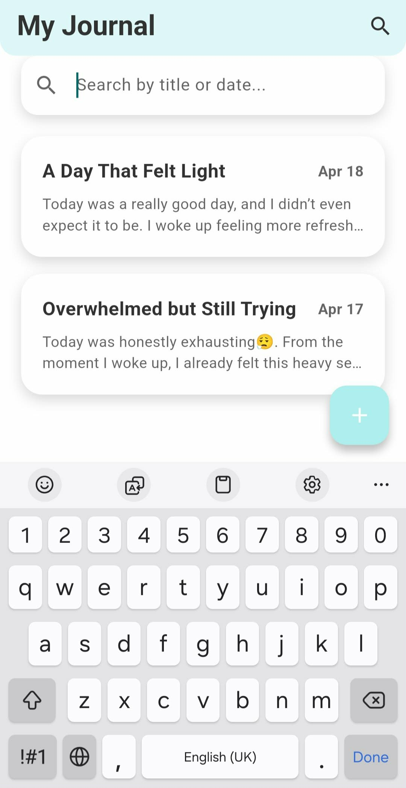
   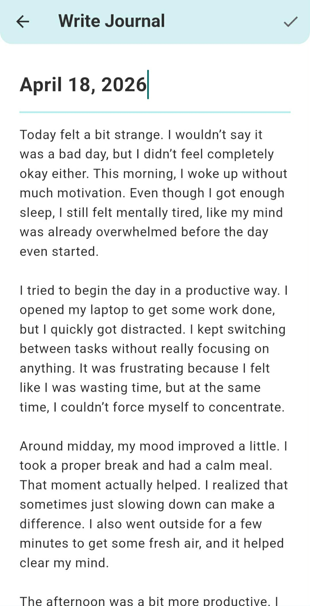
</p>

### Relaxation & AI Companion
<p align="center">
   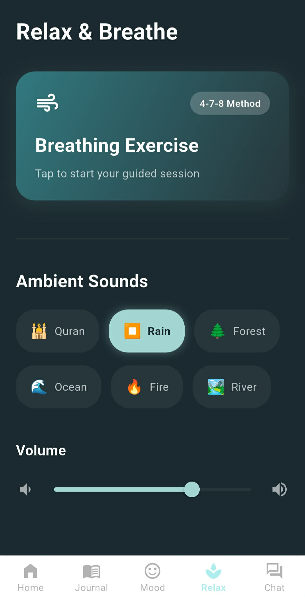
   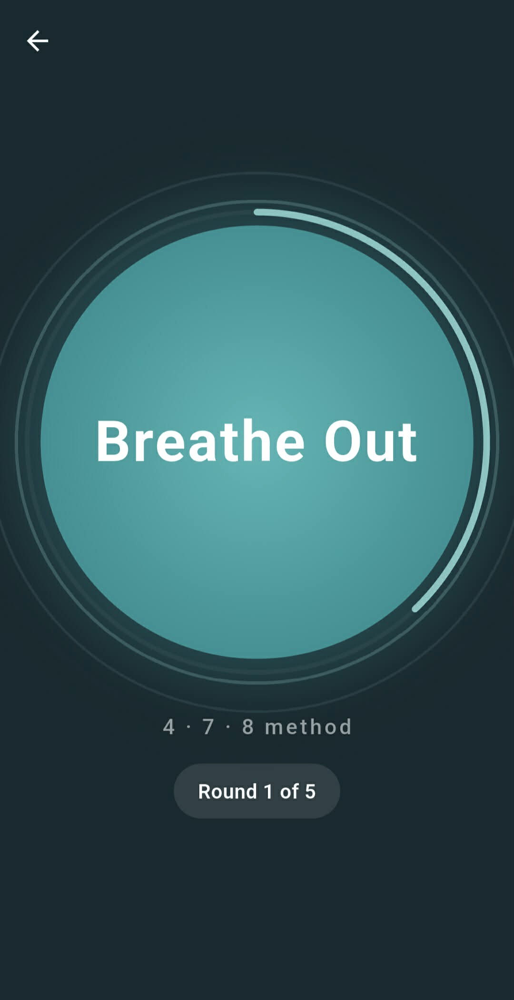
   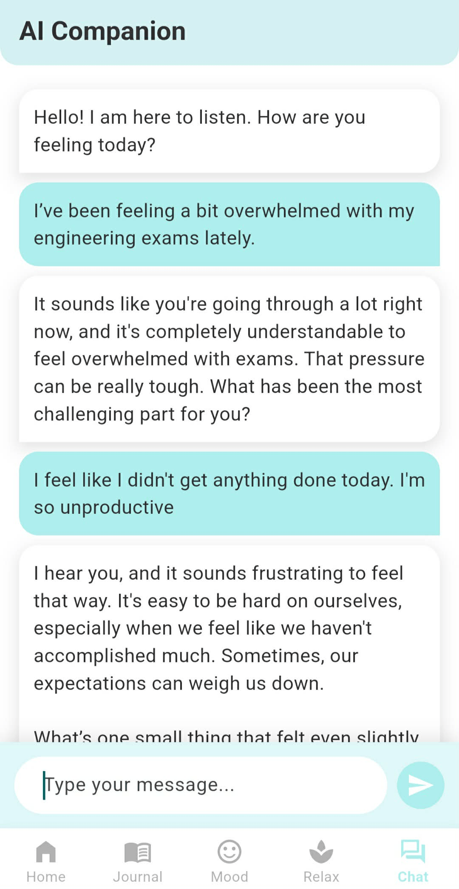
</p>

---

## 🚀 Getting Started

### Prerequisites
- Flutter SDK (v3.0 or higher) - [Install Flutter](https://flutter.dev/docs/get-started/install)
- Dart SDK (included with Flutter)
- [Firebase Account](https://firebase.google.com) - for backend services
- [OpenRouter API Key](https://openrouter.ai) - for AI features

### Installation

1. **Clone the repository** 
   ```bash
   git clone https://github.com/Imen-rekik/mentalbloom.git
   cd mentalbloom
   ```

2. **Install dependencies**
   ```bash
   flutter pub get
   ```

3. **Configure Firebase**
   - Create a Firebase project at [firebase.google.com](https://firebase.google.com)
   - Download your `google-services.json` (Android) / `GoogleService-Info.plist` (iOS)
   - Place in the appropriate directories: `android/app/` and `ios/Runner/`

4. **Set up environment variables**
   
   ⚠️ **IMPORTANT: Never commit secrets to version control!**
   
   - Copy the example file:
     ```bash
     cp .env.example .env
     ```
   
   - Edit `.env` and add your credentials:
     ```
     OPENROUTER_API_KEY=sk-or-v1-YOUR_KEY_HERE
     ```
   
   - `.env` is in `.gitignore` and will not be committed
   
   - **Get your OpenRouter API Key:**
     1. Go to [OpenRouter Dashboard](https://openrouter.ai)
     2. Create an account and generate an API key
     3. Add it to your `.env` file

5. **Configure Firebase locally**
   - Run the FlutterFire CLI to generate the `lib/firebase_options.dart` file for your Firebase project:
     ```bash
     dart pub global activate flutterfire_cli
     flutterfire configure
     ```
   - This will create `lib/firebase_options.dart` with your project's credentials
   - Since Firebase security rules are strict, this file can be safely committed to version control

6. **Run the app**
   ```bash
   flutter run
   ```

### Running on Different Platforms
- **Android:** `flutter run -d android`
- **iOS:** `flutter run -d ios`
- **Web:** `flutter run -d web`

---

## 📁 Project Structure

```
mentalbloom/
├── lib/
│   ├── main.dart                         # App entry point
│   ├── firebase_options.dart             # Firebase configuration
│   ├── screens/
│   │   ├── login/                        # Authentication screens
│   │   ├── dashboard_screen.dart         # Home dashboard 
│   │   ├── chatbot_screen.dart          # AI-powered conversation interface
│   │   ├── mood_entry_screen.dart       # Mood logging interface
│   │   ├── breath_screen.dart           # breathing exercises
│   │   ├── relax_screen.dart            # Relaxation features
│   │   ├── journal_screen.dart          # Journal list and browser
│   │   ├── journal_editor_screen.dart   # journal editor
│   │   ├── gratitude_jar_screen.dart    # Gratitude jar
│   │   └── history_analytics_screen.dart # charts
│   ├── services/
│   │   ├── ai_service.dart              # OpenRouter API integration
│   │   └── firebase_service.dart        # Firebase backend logic
│   ├── theme/
│   │   └── app_colors.dart              # color scheme
├── assets/
│   └── audio/
│       ├── fire.mp3                     # fire sound
│       ├── forest.mp3                   # Forest ambience
│       ├── ocean.mp3                    # Ocean sound
│       ├── rain.mp3                     # Rainfall sound
│       └── river.mp3                    # River sound
├── pubspec.yaml                         # Flutter dependencies
├── firebase.json                        # Firebase configuration
└── README.md                            # This file
```

## 🔧 Development

### Building for Production
```bash
flutter build apk        # Android APK
flutter build ios        # iOS IPA
flutter build web        # Web build
```

### Running Tests
```bash
flutter test
```

---

## 🤝 Contributing

Contributions are welcome!

---

## 📬 Get In Touch

**Let's connect!**

- **GitHub:** https://github.com/Imen-rekik 
- **LinkedIn:** https://www.linkedin.com/in/imen-rekik-36322b375/
- **Email:** imen.rekik2026@gmail.com

---
