# MentalBloom
 


[](LICENSE)
 
Mental health struggles are often invisible until they become overwhelming. MentalBloom is an AI-powered mobile wellness companion that helps users recognize emotional patterns early — through mood tracking, reflective journaling, guided mindfulness, and anonymous peer support.
 
Built with Flutter and Firebase, it integrates OpenRouter to orchestrate **13 large language models from 8 providers** across two distinct fallback configurations. The AI layer powers three independent services: an empathetic conversational chatbot, a context-aware content moderation system, and a daily mood narrative generator — each with automatic fallback logic to ensure continuous availability.
 
This project was built to explore the real challenges of integrating LLMs into a mobile app — multi-model resilience, real-time data sync, and responsible AI design in a sensitive context.
 
---
## 📸 Screenshots
 
### Authentication
<p align="center">
   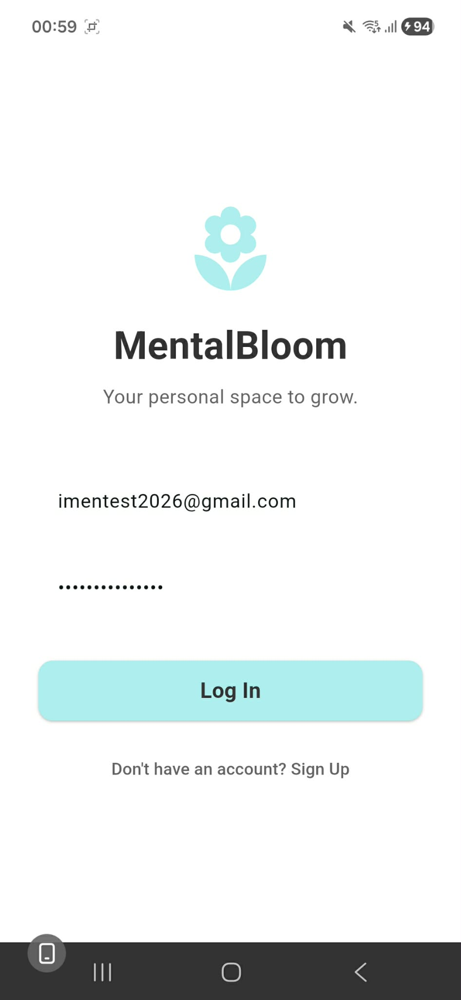
   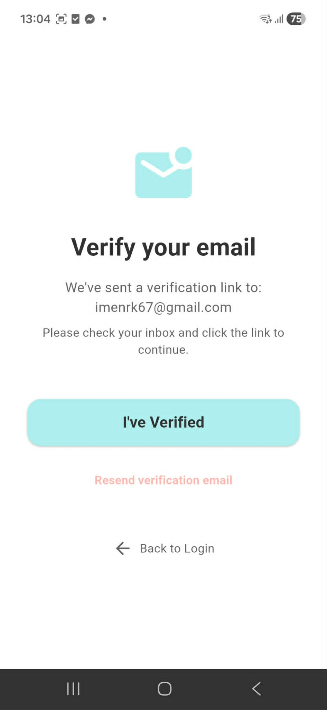
   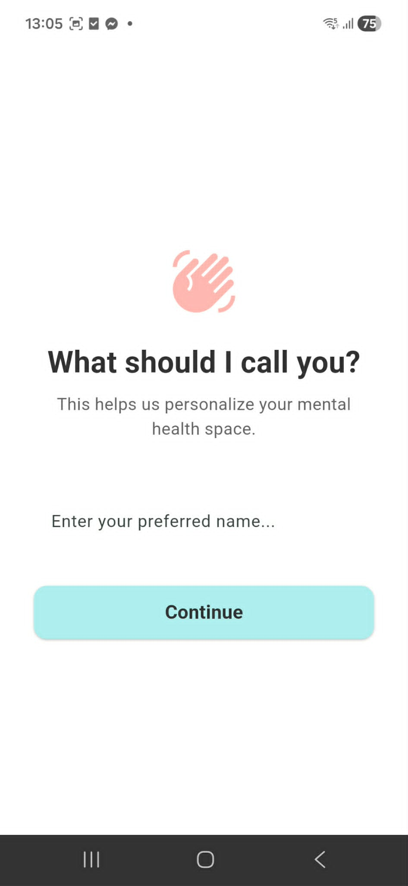
</p>

### Dashboard & Mood Tracking
<p align="center">
   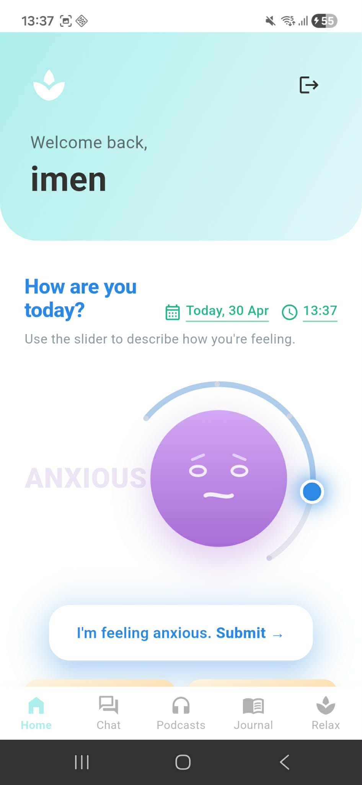
   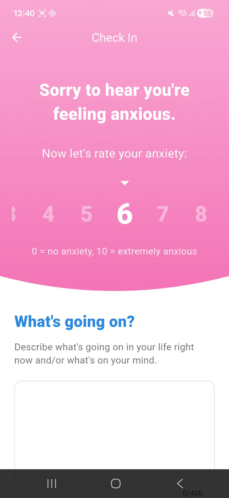
   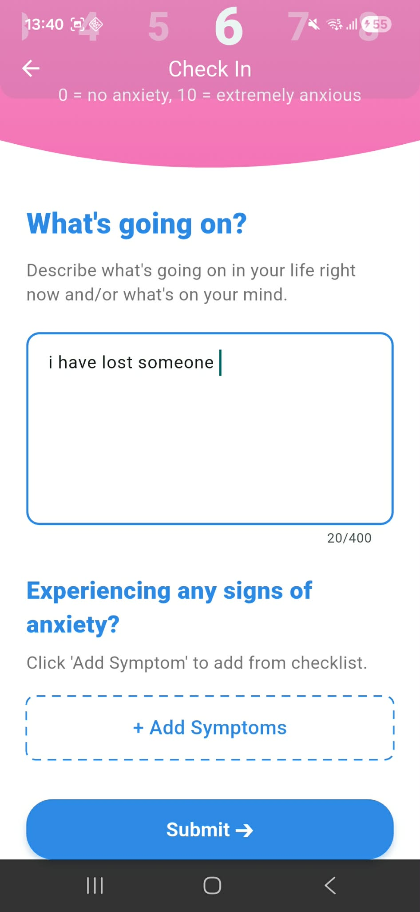
</p>
<p align="center">
   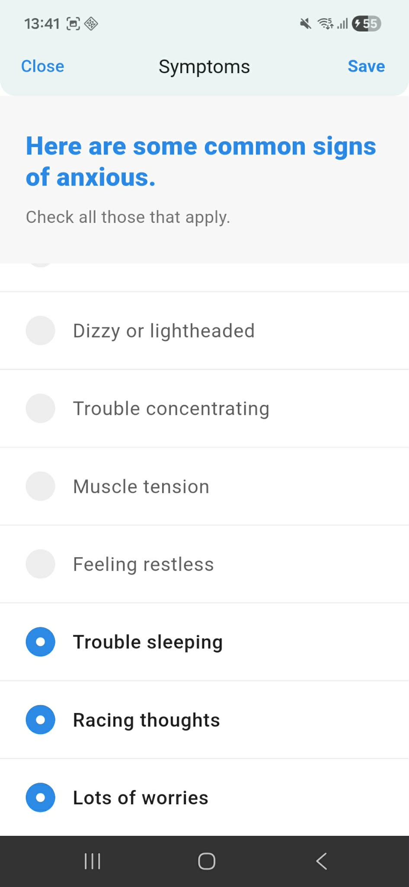
   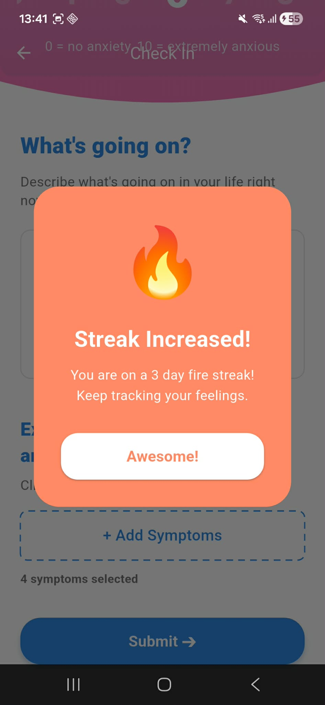
</p>

### Gratitude & Quotes
<p align="center">
   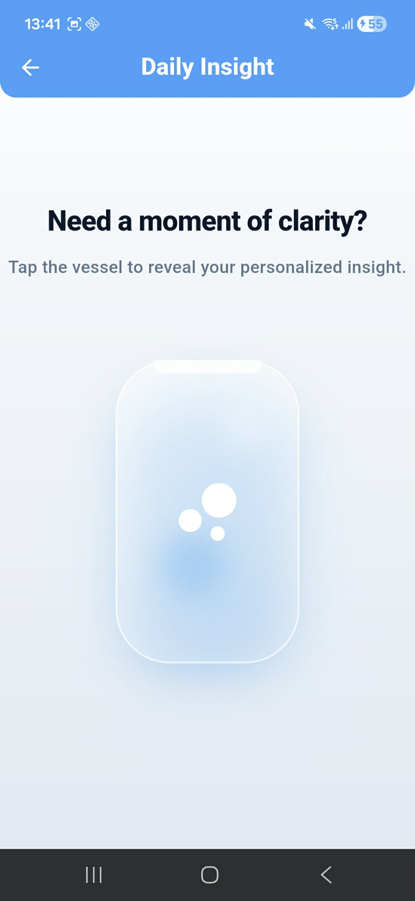
   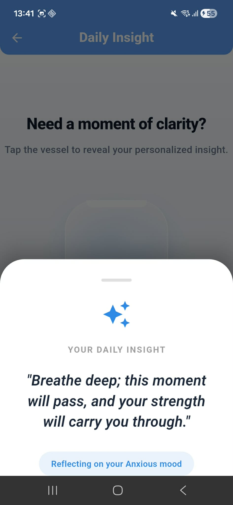
</p>

### quick relief modal
<p align="center">
   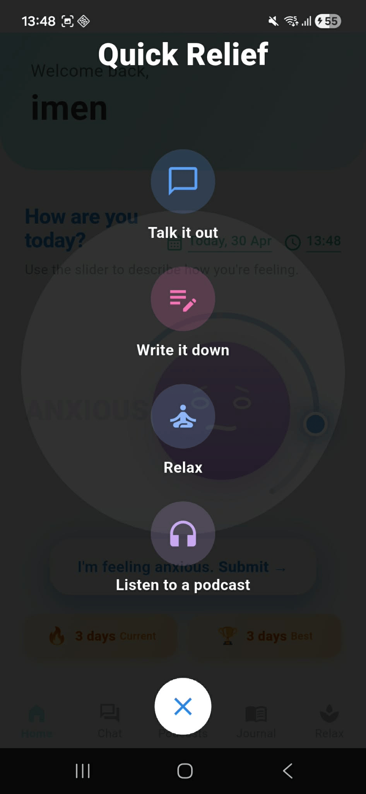
</p>

### Chatbot & Community
<p align="center">
   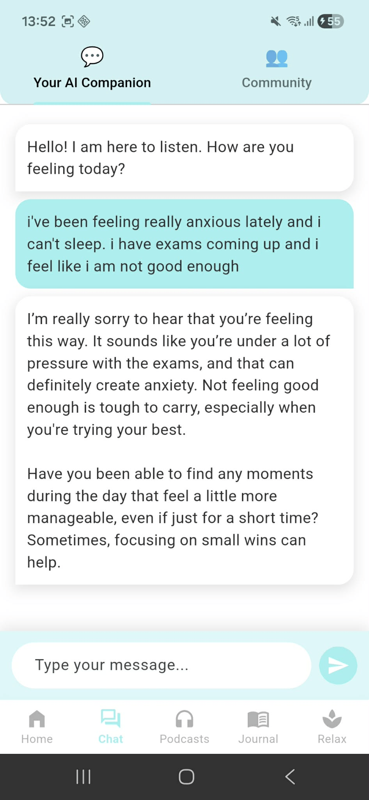
   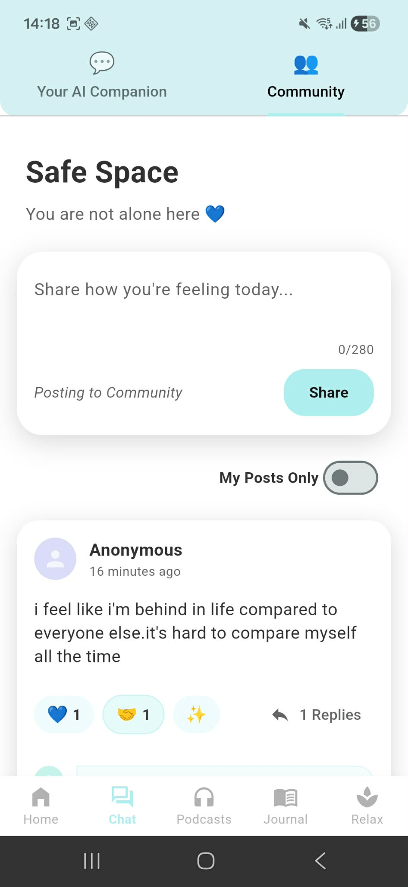
   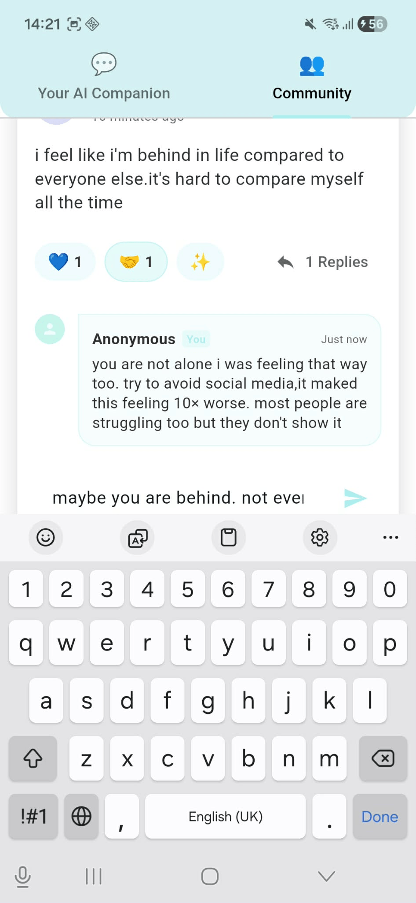
</p>
<p align="center">
   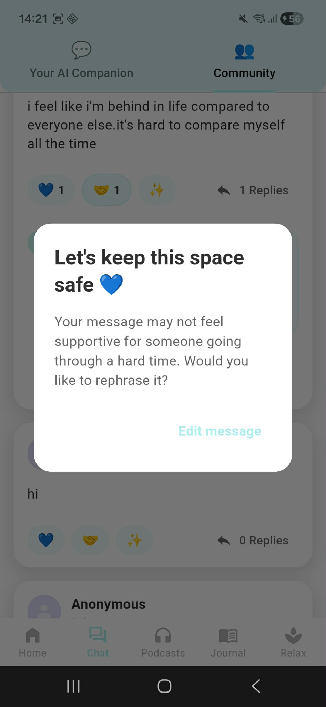
</p>

### Journaling
<p align="center">
   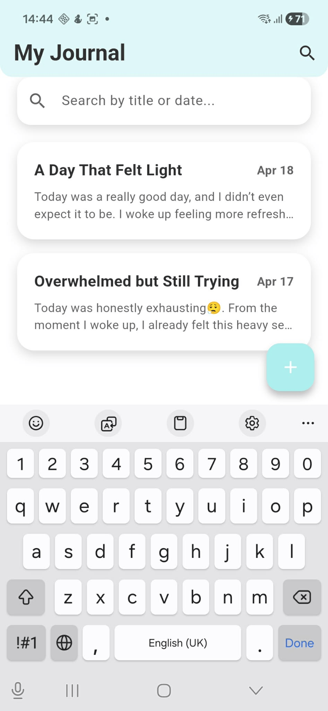
   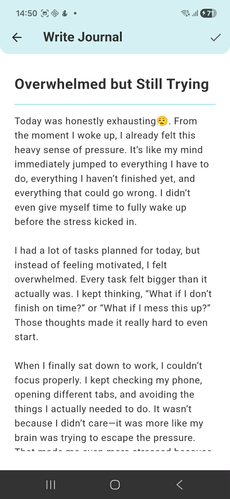
</p>

### Relaxation and podcast
<p align="center">
   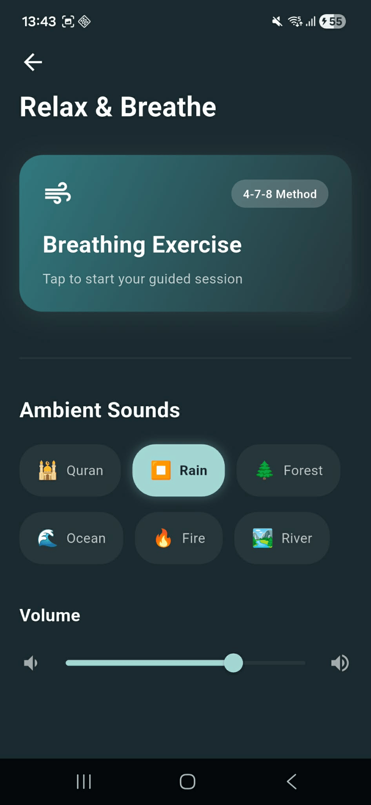
   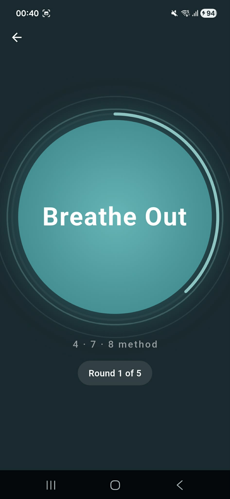
   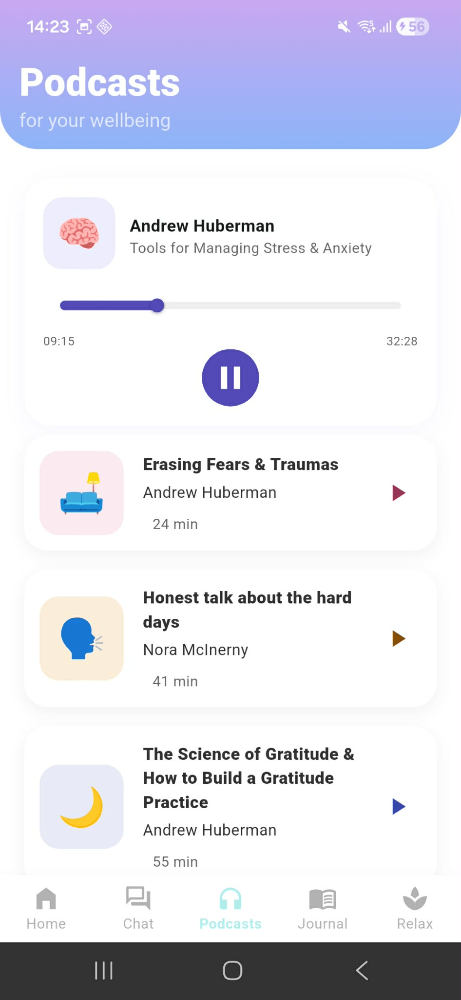
</p>

### Mood tracking
<p align="center">
   
   
   
</p>

### Mood summary
<p align="center">
   
   
</p>

### Notification
<p align="center">
   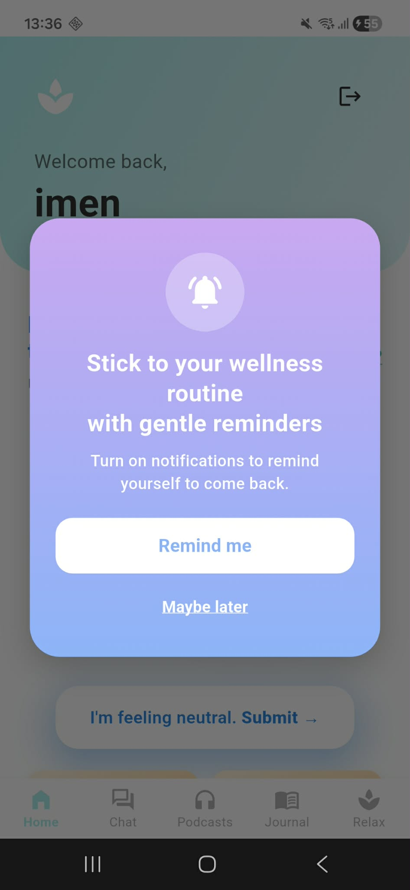
   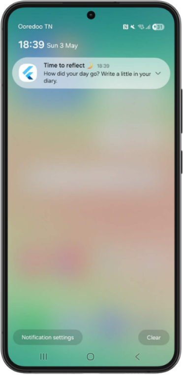
</p>
---
  
## 🛠 Tech Stack
 
### **Core Technologies**
* **Flutter (Material 3)**: Cross-platform mobile framework for a high-performance, responsive, and emotionally considered UI.
* **Dart**: Type-safe, expressive language used for the entire application logic.
### **AI Implementation**
* **LLM Orchestration**: Integrated **OpenRouter API** to dynamically access 13 state-of-the-art models including `GPT-4o Mini`, `Claude 3.5 Haiku`, `Gemini Flash 1.5`, `Llama 3.3 70B`, `DeepSeek R1`, `Mistral`, `Qwen 2.5`, and more.
* **Three AI Services**:
  * 🤖 **Chatbot Service** — prioritizes conversational speed and empathy; uses `GPT-4o Mini`, `Claude 3.5 Haiku`, and `Llama 3.3 70B` in Group 1.
  * 🛡️ **Content Moderation Service** — evaluates community posts for emotional harm using structured JSON classification (`{"safe": true/false, "reason": "..."}`).
  * 📝 **Mood Narrative Service** — synthesizes mood entries, journal content, and chat history into a personalized 3–4 sentence daily reflection.
* **Multi-Model Fallback Architecture**: Models are organized into 3 sequential groups per service. If Group 1 fails (rate limits or provider outage), the system retries with Group 2, then Group 3 — ensuring continuous AI availability.
* **Prompt Engineering**: Custom system prompts tuned per service, including a hard-coded crisis protocol in the chatbot that detects distress signals and recommends professional support.
* **AI Response Caching**: Daily narrative summaries are stored in Firestore and retrieved instantly on subsequent requests for the same date, eliminating redundant API calls.
### **Backend & Infrastructure**
* **Firebase Auth**: Secure user sessions with email verification enforced before access is granted.
* **Cloud Firestore**: Real-time, scalable data persistence for moods, journals, chat sessions, AI summaries, and community posts — with strict per-user security rules.
* **Data Visualization**: `fl_chart` for mood intensity trend charts and emotional distribution analytics.
* **Notifications**: `flutter_local_notifications` for daily mood check-in and journaling reminders.
* **Audio**: `audioplayers` for ambient sounds and podcast playback.
---
 
## ✨ Features
 
### 🧠 Core Wellness Features
- 🎯 **Mood Tracking** — Interactive arc dial mapping 5 emotional states; each check-in includes emotion label, intensity (0–10), symptom checklist, and personal notes
- 🔥 **Streak System** — Tracks consecutive daily check-ins with celebratory overlay notifications
- 📝 **Journaling** — Full-screen diary editor with search by title or date; entries feed into the AI daily summary
- 🌸 **Insight Vessel** — Tap-to-reveal animated vessel that generates an AI motivational quote based on your most recent mood
- ⚡ **Quick Relief Modal** — Post check-in action menu: Talk it out, Write it down, Relax, Listen to a podcast
- 🌬️ **Breathing Exercises** — Guided 4-7-8 breathing with immersive animated interface; can run simultaneously with ambient sounds
- 🎵 **Ambient Sounds** — 6 looping audio options: Quran, Rain, Forest, Ocean, Fire, River
- 🎙️ **Podcast Library** — Curated mental wellness episodes (e.g. Andrew Huberman, personal stories) accessible directly or via Quick Relief
- 👥 **Anonymous Community (Safe Space)** — Peer-support feed where all posts appear under "Anonymous," protected by AI content moderation before publication
- 📊 **Analytics & History** — 14-day mood intensity bar chart with emotion filters, date-picker history, and AI-generated daily narrative summaries
### 🤖 AI-Powered Features
- **Empathetic Chatbot** — Warm, non-judgmental AI companion with full conversation history and a hard-coded crisis protocol
- **Content Moderation** — AI pre-screens every community post; harmful content is blocked with a compassionate "rephrase" prompt
- **Daily Mood Narrative** — Cross-feature synthesis: mood entries + journal + chat history → personalized 3–4 sentence reflection
- **Personalized Quotes** — Mood-contextual motivational quotes generated via the Insight Vessel
### 🔐 Authentication & Security
- Email/password registration with mandatory email verification
- Firestore security rules enforce strict per-user data isolation
- API keys managed via `flutter_dotenv` and excluded from version control
---
 
## 🏗️ Architecture
 
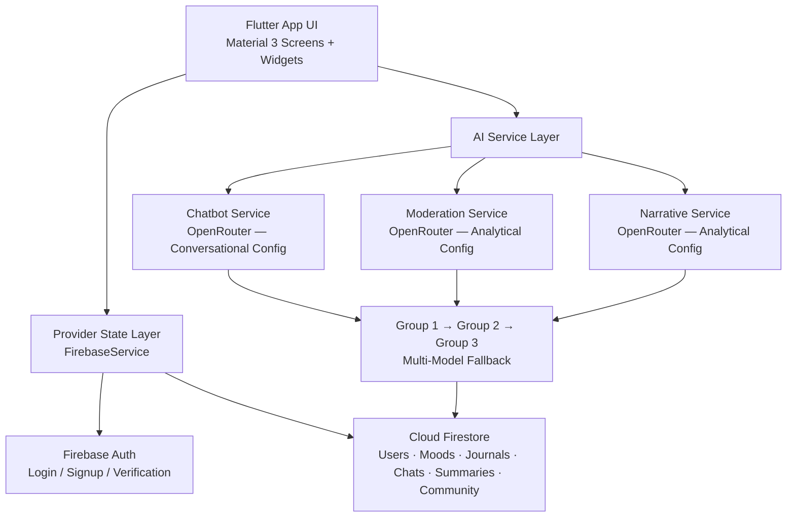
```mermaid
flowchart TD
   A[Flutter App UI\nMaterial 3 Screens + Widgets] --> B[Provider State Layer\nFirebaseService]
   B --> C[Firebase Auth\nLogin / Signup / Verification]
   B --> D[Cloud Firestore\nUsers · Moods · Journals · Chats · Summaries · Community]
   A --> E[AI Service Layer]
   E --> F1[Chatbot Service\nOpenRouter — Conversational Config]
   E --> F2[Moderation Service\nOpenRouter — Analytical Config]
   E --> F3[Narrative Service\nOpenRouter — Analytical Config]
   F1 --> G[Group 1 → Group 2 → Group 3\nMulti-Model Fallback]
   F2 --> G
   F3 --> G
   G --> D
```
 
### AI Fallback Groups
 
| Service | Group 1 | Group 2 | Group 3 |
|---|---|---|---|
| **Chatbot** | GPT-4o Mini · Claude 3.5 Haiku · Llama 3.3 70B | Gemini Flash 1.5 · Mistral 7B · DeepSeek R1 | Qwen 2.5 72B · Gemini 2.0 Flash Thinking · Phi-3 Mini |
| **Moderation & Narrative** | Qwen 2.5 72B · Llama 3.3 70B · Gemini Flash 1.5 | DeepSeek R1 · Mistral Small 24B · Gemini 2.0 Flash Lite | GPT-4o Mini · Claude 3 Haiku · Mistral Nemo |
 
---
 
## 🚀 Getting Started
 
### Prerequisites
- Flutter SDK (v3.0 or higher) — [Install Flutter](https://flutter.dev/docs/get-started/install)
- Dart SDK (included with Flutter)
- [Firebase Account](https://firebase.google.com) — for backend services
- [OpenRouter API Key](https://openrouter.ai) — for all AI features
### Installation
 
1. **Clone the repository**
   ```bash
   git clone https://github.com/Imen-rekik/mentalbloom.git
   cd mentalbloom
   ```
 
2. **Install dependencies**
   ```bash
   flutter pub get
   ```
 
3. **Configure Firebase**
   - Create a Firebase project at [firebase.google.com](https://firebase.google.com)
   - Download your `google-services.json` (Android) / `GoogleService-Info.plist` (iOS)
   - Place in the appropriate directories: `android/app/` and `ios/Runner/`
4. **Set up environment variables**
   ⚠️ **IMPORTANT: Never commit secrets to version control!**
   ```bash
   cp .env.example .env
   ```
 
   Edit `.env` and add your credentials:
   ```
   OPENROUTER_API_KEY=sk-or-v1-YOUR_KEY_HERE
   ```
 
   `.env` is in `.gitignore` and will not be committed.
   **Get your OpenRouter API Key:**
   1. Go to [OpenRouter Dashboard](https://openrouter.ai)
   2. Create an account and generate an API key
   3. Add it to your `.env` file
5. **Configure Firebase locally**
   ```bash
   dart pub global activate flutterfire_cli
   flutterfire configure
   ```
   This generates `lib/firebase_options.dart` — safe to commit.
6. **Run the app**
   ```bash
   flutter run
   ```
 
### Running on Different Platforms
- **Android:** `flutter run -d android`
- **iOS:** `flutter run -d ios`
- **Web:** `flutter run -d web`
---
 
## 📁 Project Structure
 
```
mentalbloom/
├── lib/
│   ├── main.dart                                  # App entry point
│   ├── firebase_options.dart                      # Firebase configuration
│   ├── models/
│   │   └── community_post.dart                    # Community post data model
│   ├── screens/
│   │   ├── main_layout.dart                       # Bottom navigation shell
│   │   ├── login_screen.dart                      # Login
│   │   ├── email_verification_screen.dart         # Email verification gate
│   │   ├── name_entry_screen.dart                 # First-time name setup
│   │   ├── dashboard_screen.dart                  # Home dashboard
│   │   ├── mood_check_in_section.dart             # Mood arc dial widget
│   │   ├── mood_entry_screen.dart                 # Intensity, symptoms, notes
│   │   ├── mood_details_screen.dart               # Individual mood entry detail
│   │   ├── gratitude_jar_screen.dart              # Insight Vessel + AI quote
│   │   ├── quick_relief_modal.dart                # Post check-in action menu
│   │   ├── chatbot_screen.dart                    # AI companion chat
│   │   ├── community_screen.dart                  # Anonymous Safe Space feed
│   │   ├── journal_screen.dart                    # Journal list and search
│   │   ├── journal_editor_screen.dart             # Full-screen journal editor
│   │   ├── relax_screen.dart                      # Ambient sounds hub
│   │   ├── breath_screen.dart                     # Guided breathing exercise
│   │   ├── podcast_screen.dart                    # Podcast library player
│   │   ├── history_analytics_screen.dart          # Charts, mood history, AI narrative
│   │   └── notification_permission_prompt.dart    # Notification opt-in screen
│   ├── services/
│   │   ├── firebase_service.dart                  # Firebase Auth + Firestore logic
│   │   ├── ai_service.dart                        # Chatbot + quote generation (OpenRouter)
│   │   ├── moderation_service.dart                # AI content moderation
│   │   ├── mood_summary_service.dart              # Daily narrative generation + caching
│   │   ├── podcast_provider.dart                  # Podcast state and playback
│   │   ├── notification_scheduler.dart            # Daily reminder scheduling
│   │   └── notification_prompt_service.dart       # Notification permission logic
│   └── theme/
│       └── app_colors.dart                        # Color scheme (Material 3)
├── assets/
│   └── audio/
│       ├── fire.mp3
│       ├── forest.mp3
│       ├── ocean.mp3
│       ├── rain.mp3
│       └── river.mp3
├── pubspec.yaml                                   # Flutter dependencies
├── firebase.json                                  # Firebase configuration
├── .env.example                                   # Environment variable template
└── README.md
```
 
---
 
## 🔧 Development
 
### Building for Production
```bash
flutter build apk        # Android APK
flutter build ios        # iOS IPA
flutter build web        # Web build
```
 
### Running Tests
```bash
flutter test
```
 
---
 
## 🤝 Contributing
 
Contributions are welcome! Feel free to open issues or submit pull requests.
 
---
 
## 📬 Get In Touch
 
**Let's connect!**
 
- **GitHub:** https://github.com/Imen-rekik
- **LinkedIn:** https://www.linkedin.com/in/imen-rekik-36322b375/
- **Email:** imen.rekik2026@gmail.com
 